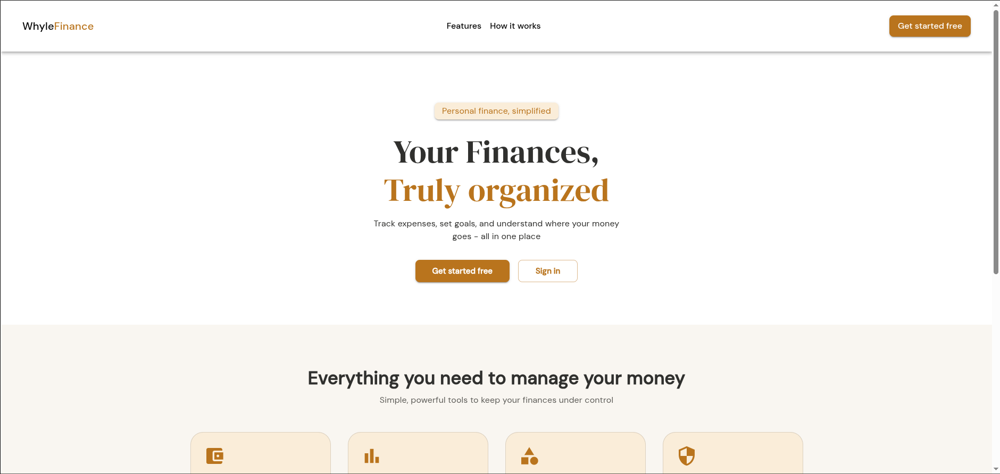
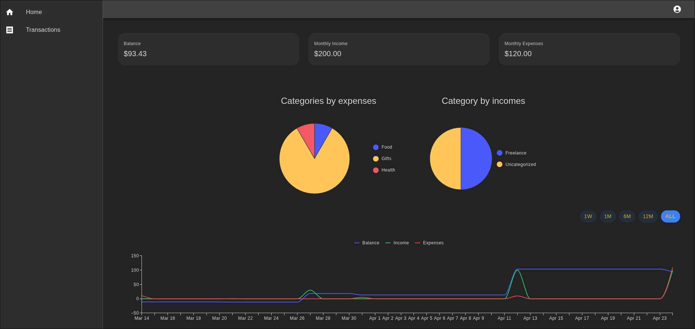
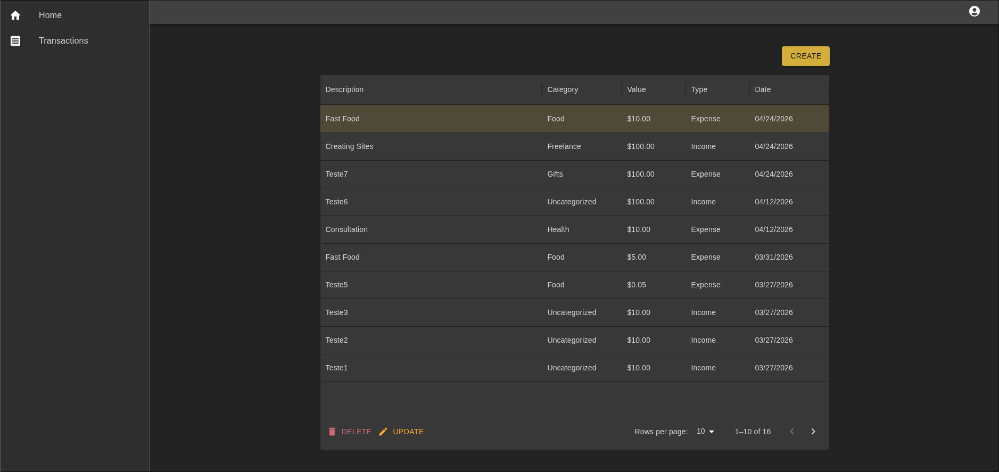

# WhyleFinance

WhyleFinance is a personal finance management platform to track expenses, organize income, and gain control over your money — with interactive charts and a clean dashboard.

🌐 **Live:** [app.whylefinance.dev](https://app.whylefinance.dev)


---
## Screenshots





## Features

- 🔐 JWT authentication with HttpOnly cookies and automatic token refresh
- 📧 Email verification and password reset via Resend
- 💸 Full transaction management — create, edit, and delete income and expenses
- 🏷️ Custom categories for income and expenses
- 📊 Interactive charts — donut charts by category and line chart with period filters (1W, 1M, 6M, 12M, ALL)
- 📅 Monthly summary with balance, total income and total expenses
- 📱 Responsive design for mobile and desktop
- 👤 User profile management — change username, name, email and password

---

## Tech Stack

### Frontend
| Technology | Usage |
|---|---|
| React + TypeScript | UI framework |
| Vite | Build tool |
| MUI (Material UI) | Component library |
| MUI X Charts | Data visualization |
| React Hook Form | Form management |
| Axios | HTTP client |
| React Router | Client-side routing |

### Backend
| Technology | Usage |
|---|---|
| Python + Django | Web framework |
| Django REST Framework | REST API |
| SimpleJWT | JWT authentication |
| Resend | Transactional emails |

## Running Locally

### Prerequisites
- Python 3.13+
- Pipenv
- Node.js 18+

### Backend

```bash
git clone https://github.com/JoaoVitor197843/whyle-finance.git
cd whyle-finance
pipenv install
pipenv shell
cd backend
# configure your environment variables
python manage.py migrate
python manage.py runserver
```

### Frontend

```bash
cd frontend
npm install
# configure your environment variables
npm run dev
```

### Environment Variables

**Backend `.env`:**
```env
DEVELOPMENT_SECRET_KEY=
PRODUCTION_SECRET_KEY=
DB_NAME=
DB_USER=
DB_PASSWORD=
DB_HOST=
RESEND_API_KEY=
RESEND_EMAIL=
```

**Frontend `.env`:**
```env
VITE_API_URL=
```

## License

This project is licensed under the [MIT](LICENSE) License.